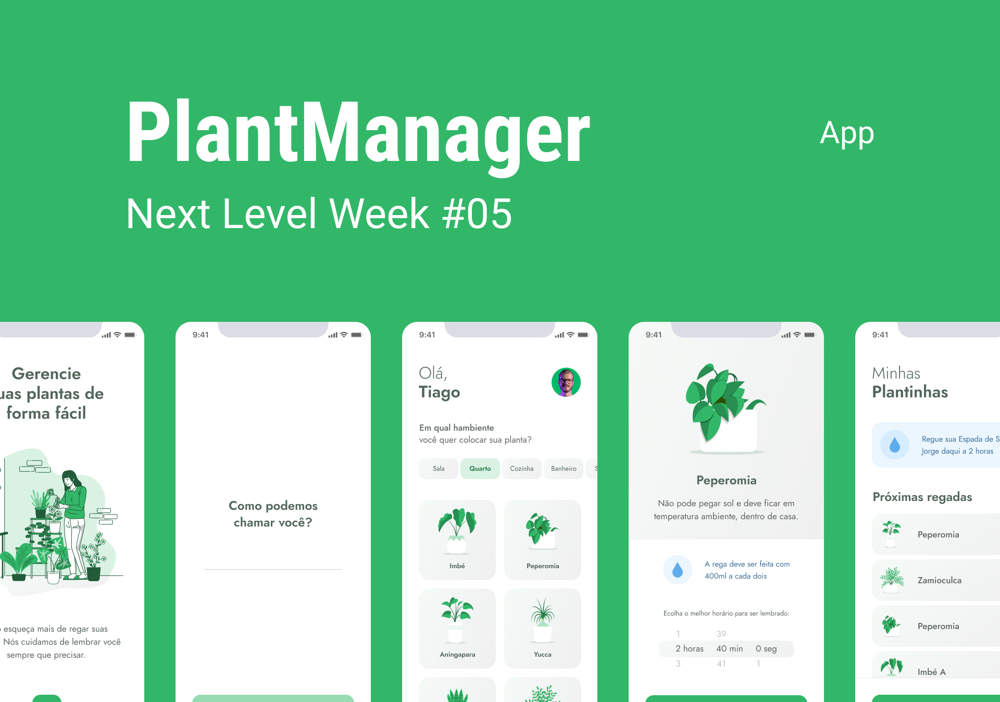

<p align="center">
  
</p>

# PlantManager
   


<p align="center">
  
</p>

<p align="center">
  
</p>


* [Content (en-US)](#section-en_us)
* [Conteúdo (pt-BR)](#secao-pt_br)

---

## About the project <a id="section-en_us"></a>

PlantManager is a plant management application, where the user can choose the plants he has from a list of plants, and create a watering schedule for them, ensuring that they are watered according to their needs.
The application accesses an API that has basic information about the plants, as well as data on the correct watering frequency. When registering a plant, the user must choose a time to water, where the application will send a notification using the Expo Notifications library. As long as plant data is not loaded, an LottieFiles animation is displayed, to improve the user experience. The data of the plants chosen by the user are saved locally on the device via AsyncStorage.

## Content
  * [Techs](#techs)
  * [How to run the project](#installation)
    * [Installation - Mobile](#installation-mobile)

## Techs <a id="techs"></a>

- [x] React Native
- [x] Expo
- [x] date-fns
- [x] LottieFiles
- [x] Expo Notifications

## How to execute the project <a id="installation"></a>
To execute the project, you'll need to have Node and NPM or Yarn installed to setup all the dependencies.


### Installation - Mobile (App) <a id="installation-mobile"></a>

Go to `api.ts` file inside `src/services` and change to your machine's server IP address.
If you need to install *Expo*, execute the following command: `yarn global add expo-cli`.
After, execute the project.


```bash
npm install
npm start
npm server
```

If you are using Yarn, use this:
```bash
yarn install
yarn start
yarn server
```

When executing the project, *Expo's* debug page will open in your browser.

To open the app in your mobile device, download *Expo's* app at Play Store or App Store and scan the QR code shown in the debug page, and wait until the installation finishes.

---

## Sobre o projeto <a id="secao-pt_br"></a>

O PlantManager é um aplicativo de gerenciamento de plantas, onde o usuário pode escolher as plantas que ele tem entre uma lista de plantas, e criar um cronograma de regamento para elas, garantindo que elas sejam regadas de acordo com a sua necessidade.
O aplicativo acessa uma API que possui informações básicas sobre as plantas, assim como os dados sobre a frequência correta de regamento delas. Ao cadastrar uma planta, o usuário deve escolher um horário para regar, onde o aplicativo enviará uma notificação utilizando a biblioteca Expo Notifications. Enquanto os dados das plantas não são carregados, uma animação do LottieFiles é exibida, para melhorar a experiência do usuário. Os dados das plantas escolhidas pelo usuário são salvos localmente no dispositivo através do AsyncStorage.

## Conteúdos 
  * [Tecnologias](#tecnlogias)
  * [Como executar o projeto](#instalacao)
    * [Instalação - Mobile](#instalacao-mobile)

## Tecnologias <a id="tecnologias"></a>

- [x] React Native
- [x] Expo
- [x] date-fns
- [x] LottieFiles
- [x] Expo Notifications

## Como executar o projeto <a id="instalacao"></a>
Para executar o projeto, você irá precisar ter o Node e o NPM ou Yarn instalados para baixar as dependências.


### Instalação - Mobile (Aplicativo) <a id="instalacao-mobile"></a>

Vá no arquivo `api.ts` dentro de `src/services` e coloque o endereço IP da máquina que está executando o seu servidor. 
Se precisar instalar o *Expo*, execute o comando `yarn global add expo-cli`.
Em seguida, execute o projeto

```bash
npm install
npm start
npm server
```

Se estiver usando Yarn, utilize
```bash
yarn install
yarn start
yarn server
```

Ao executar o projeto, a página de debug do *Expo* será aberta no seu navegador. 

Para executar o aplicativo no seu dispositivo, baixe o aplicativo *Expo* na Play Store ou App Store e faça o scan do código QR que será disponibilizado na página de debug, e aguarde a instalação.

---
###### Developed on Next Level Week from [Rocketseat](https://rocketseat.com.br) by [Gean Lucas](https://www.linkedin.com/in/geanlucaas/) :rocket:.